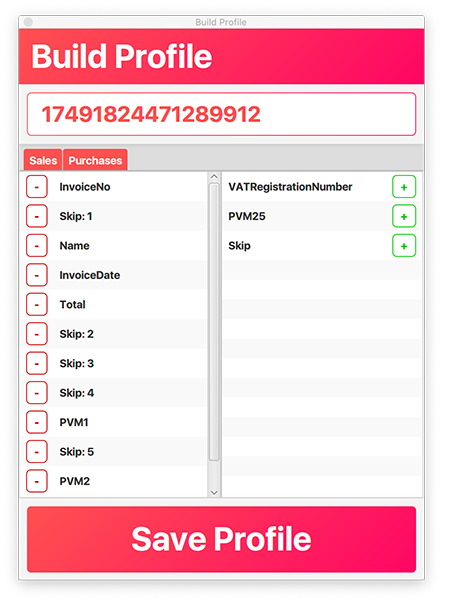

# isafToXML

## Parses an xlsx (excel) file into an appropriate [isaf](https://imas.vmi.lt/isaf/aboutIsaf/) formatted XML file

### To define how the data in the excel file is layed out one must create a data profile which is saved where the jar is

